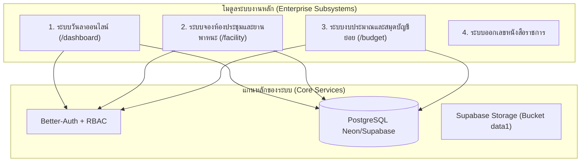

# Session Handoff & System Architectural Rulebook (v3.0)

**Project:** KP e-Leave & School Enterprise System (โรงเรียนกุดจับประชาสรรค์)  
**Updated Date:** 2026-09-11  
**Working Branch:** `dev`  
**Production Branch:** `main` (ต่อกับ Vercel Auto-Deployment)  
**Git Remotes:**
- `origin`: `https://github.com/Kutchapprachasan-School/KP_eLeave_System.git`
- `school`: `https://github.com/khamyangpittayaschool-code/e-leave.git` (Mirror ผ่าน GitHub Actions)

---

## 1. กฎเหล็กการพัฒนาและ Deploy (Strict Deployment Principles)

### 📌 กฎข้อที่ 1: การทำงานบนกิ่ง `dev` เท่านั้น (Development Branch Rule)
> *"ต่อไปพัฒนาใน branch dev เท่านั้น ห้าม commit ตรงเข้า main"*
- **ทุกฟีเจอร์ บั๊กฟิกซ์ และการทดสอบ ต้องทำบนกิ่ง `dev` เท่านั้น**
- กิ่ง `main` มีไว้สำหรับ Production Deployment เท่านั้น
- เมื่อผู้ใช้สั่งให้ "เอาขึ้น main" หรือ "Deploy" ให้ทำตาม **ขั้นตอนการ Deploy มาตรฐาน (Standard Deployment Pipeline)**

### 📌 กฎข้อที่ 2: ขั้นตอนการ Deploy มาตรฐาน (Standard Git Pipeline to Production)
เมื่อการพัฒนาและทดสอบบนกิ่ง `dev` ผ่านเรียบร้อยแล้ว ให้ปฏิบัติตามลำดับคำสั่งนี้เสมอ:
```bash
# 1. ตรวจสอบสถานะไฟล์และคอมมิตงานบน dev
git status
git add .
git commit -m "feat(scope): คำอธิบายฟังก์ชันที่เพิ่มหรือแก้ไข"

# 2. ผลักดันกิ่ง dev ขึ้น GitHub
git push origin dev

# 3. สลับไปกิ่ง main และผสานโค้ด (Merge)
git checkout main
git merge dev

# 4. ผลักดันกิ่ง main ขึ้น GitHub (ทริกเกอร์ Vercel Build และ GitHub Actions Mirror)
git push origin main

# 5. สลับกลับมาที่กิ่ง dev เพื่อทำงานต่อไปทันที
git checkout dev
```
> **หมายเหตุ:** ทันทีที่ `origin/main` ได้รับโค้ดใหม่:
> 1. **Vercel** จะเริ่ม Build และ Deploy ระบบจริงขึ้น Production อัตโนมัติ
> 2. **GitHub Actions Workflow** [`.github/workflows/mirror-to-school.yml`](file:///g:/My%20Drive/01%20Web%20app/01%20ระบบการลา/.github/workflows/mirror-to-school.yml) จะทำการ Sync โค้ดไปยัง `school/main` โดยอัตโนมัติ

---

## 2. กฎความปลอดภัยของฐานข้อมูล Production (Database & Migration Protocol)

1. **ห้ามใช้คำสั่งทำลายข้อมูลเด็ดขาด (No Destructive Migrations):**
   - **ห้ามรัน `prisma migrate reset` บน Production เด็ดขาด**
   - การปรับแก้ตารางต้องเป็นแบบ Additive (เช่น `ADD COLUMN IF NOT EXISTS`, ตั้งค่า Default, หรืออนุญาตให้ Nullable)
   - ใช้ `prisma db push` หรือรันสคริปต์ SQL แบบมีเงื่อนไข `IF NOT EXISTS`
2. **Global Row-Locking Hierarchy (ป้องกัน Deadlock 100%):**
   - ทุกธุรกรรมการเงินและการจองทรัพยากรที่มีการแก้ไขยอดหรือสถานะ ต้องใช้ `SELECT ... FOR UPDATE NOWAIT`
   - **ต้องเรียงลำดับ Primary Key ตามตัวอักษร (Ascending PK Order)** เสมอก่อนทำการ Acquire Lock เพื่อป้องกัน Deadlock ข้าม Transaction
3. **ห้าม Hard-Delete ข้อมูลที่มี Foreign Key อ้างอิง:**
   - ทรัพยากร (เช่น รถ/ห้องประชุมในระบบ `/facility`) ที่มีประวัติการจอง ให้ Fallback เป็น Soft-Delete/`RETIRED` เมื่อเจอ Error รหัส `P2003` หรือ `23503` (Foreign Key Constraint Violation) เท่านั้น Error อื่นให้ Throw ตามปกติ

---

## 3. กฎความปลอดภัย Next.js 16 / Turbopack / Server Actions (Vercel Build Rules)

1. **Server Action Export Safety:**
   - ทุกฟังก์ชันในไฟล์ที่ขึ้นต้นด้วย `"use server"` หากถูกเรียกใช้จากภายนอก **ต้อง Export ให้ถูกต้อง** ห้ามมี Unexported Action หรือ Dead Import ที่ทำให้ Turbopack บน Vercel Compile ไม่ผ่าน
2. **Server-to-Client Serialization Boundary:**
   - React Server Actions ไม่รองรับการส่งผ่านค่า `BigInt`, Raw Prisma Object ที่ซับซ้อน หรือ Decimal Object ออกไปยัง Client โดยตรง
   - ให้ครอบผลลัพธ์ผ่านฟังก์ชัน `serializeForClient()` หรือ `JSON.parse(JSON.stringify(...))` ก่อนส่งกลับ Client เสมอ
3. **รักษาความสะอาดของ `.vercelignore`:**
   - ไฟล์ทดสอบใน `scratch/`, `tests/`, และเอกสาร PDF/Excel ให้คงอยู่ใน `.vercelignore` เพื่อให้เครื่อง Vercel Build ทำงานรวดเร็ว ไม่กิน Memory และไม่ติด Timeout

---

## 4. สถาปัตยกรรมและโมดูลสำคัญในระบบ (System Subsystems)



| โมดูล / ระบบ | หน้าเว็บหลัก | Service / Server Actions | Architectural Invariants & ADR |
|---|---|---|---|
| **ระบบวันลา (e-Leave)** | `/dashboard`, `/print/leave` | `src/app/actions/user.ts`, `upload.ts` | ลายเซ็นต์เป็น Private Authenticated Stream (`/api/signatures/[userId]`), เก็บไฟล์ด้วย Pure ASCII Key |
| **ระบบจองยานพาหนะ/สถานที่** | `/facility` | `src/services/facility-reservation.service.ts`, `src/app/actions/facility.ts` | Lock Order เรียงตาม PK, Catch `P2003` เพื่อ Fallback เป็น `RETIRED`, Server-side RBAC |
| **ระบบงบประมาณ & แผนงาน** | `/budget` | `src/services/project-budget.service.ts`, `src/app/actions/project-budget.ts` | [ADR-001](file:///g:/My%20Drive/01%20Web%20app/01%20ระบบการลา/docs/adr/20260909-budget-simplified-disbursement-and-clone-engine.md): 5-Layer Invariants, Cash-gated Approval, FY Closure & Financial Freeze, Batch Project Cloning Engine |

---

## 5. เครื่องมือและสกิลที่ติดตั้งในระบบ (Skills Ecosystem)

- **`grill-doc`**: สกิลสัมภาษณ์และ Stress-Test แผนงาน/สถาปัตยกรรมเชิงลึก พร้อมสร้าง **Architecture Decision Record (ADR)** บันทึกไว้ใน `docs/adr/`
- **`handoff`**: สกิลสรุปและส่งต่องานระหว่างเซสชัน
- **`ui-ux-pro-max`**: คลังดีไซน์ UI/UX มาตรฐานสถานศึกษา
- **`html-planner`**: ระบบวางแผนงานแบบ Multi-Agent

---

## 6. สรุปคำสั่งสำหรับ AI ในแชทถัดไป (Quick Prompt for Future Sessions)

หากเริ่มเซสชันใหม่ ให้ AI อ่านไฟล์นี้ทันที:
1. อ่านกฎเหล็กใน [`.agent/rules/handoff.md`](file:///g:/My%20Drive/01%20Web%20app/01%20ระบบการลา/.agent/rules/handoff.md)
2. ยึดกิ่ง `dev` ในการทำงานเสมอ
3. ตรวจสอบ [ADR-001](file:///g:/My%20Drive/01%20Web%20app/01%20ระบบการลา/docs/adr/20260909-budget-simplified-disbursement-and-clone-engine.md) หากต้องแก้ไขหรือขยายระบบงบประมาณ
4. เมื่อพร้อม Deploy ให้รันขั้นตอนการ Push `dev` $\rightarrow$ Merge `main` $\rightarrow$ Push `main` ตามขั้นตอนในข้อ 1
