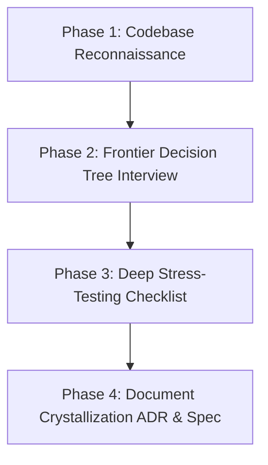

# Grill-Doc Skill

## Overview

**Grill-Doc** is a structured, relentless interrogation and alignment workflow designed to stress-test architectural ideas, feature requests, and system designs before any implementation code is written.

Finding flaws, ambiguities, and edge cases in thought or design is **100x cheaper** than debugging them in production. The "-doc" mandate ensures that as decisions crystallize through grilling, they are immediately documented into **Architecture Decision Records (ADRs)** and technical specifications, preventing decisions from being forgotten or re-litigated.

---

## When to Use This Skill

- When receiving a complex user request, refactor proposal, or new feature spec.
- When the user asks to "grill me", "grill this plan", "grill-doc", "stress test this design", or review architectural trade-offs.
- When an implementation involves high-risk domains: financial balance, concurrency, permissions, data deletion, or cross-table invariants.
- Before transitioning from planning mode to execution mode.

---

## Core 4-Phase Workflow



### Phase 1: Silent Codebase Reconnaissance (Investigate First)

**Rule:** NEVER ask the user a question that can be answered by reading the codebase.

Before asking your first round of questions:
1. Inspect the relevant database schemas (`prisma/schema.prisma` or migration files).
2. Check existing permission matrixes and RBAC rules (`src/lib/permissions.*`).
3. Check related server actions, service files, and current route implementations.
4. Note existing technical debt, established invariants, and past architectural patterns.

Ground your upcoming interview questions in concrete repository facts.

---

### Phase 2: The Frontier Decision Tree Interview

Model the feature as a **Decision Tree** where foundational decisions branch into secondary technical choices. 

Work strictly along the **Frontier** — decisions whose prerequisites are already known, rather than asking hypothetical questions about branches that may never exist.

#### Interview Rules:
1. **Rounds**: Group 2 to 4 frontier questions into a single structured round.
2. **Always Number & Label**: Clearly identify questions (e.g. `Q1`, `Q2`).
3. **Always Recommend**: For EVERY question, state a clear, opinionated **Recommended Option (➡️)** with rationale. Do not present neutral menus without engineering judgment.
4. **Pause & Wait**: After presenting a round, STOP and wait for user answers before opening the next branch.

#### Round Format Template:

```markdown
### 🛡️ Grilling Round [Number]: [Topic / Scope]

❓ **Q1 - [Decision Title]**: [Context and why this choice matters]
- **Option A**: [Description & Trade-off]
- **Option B**: [Description & Trade-off]
➡️ **Recommended Option**: **Option A** — [1-2 sentences explaining technical rationale, performance, or safety benefits].

---

❓ **Q2 - [Decision Title]**: [Context and why this choice matters]
- **Option A**: [Description]
- **Option B**: [Description]
➡️ **Recommended Option**: **Option B** — [Technical rationale].
```

---

### Phase 3: The Grilling Checklist (What to Interrogate)

During the grilling rounds, rigorously stress-test the design against these 6 dimensions:

| Dimension | Key Questions to Interrogate |
| :--- | :--- |
| **1. Business Invariants** | What states are strictly forbidden? (e.g., $SUM(allocations) > receivedAmount$, negative balance). What is the source of truth? |
| **2. Concurrency & Locks** | What happens if two users click simultaneously? Where are row locks (`FOR UPDATE`) placed? What is the global lock order to avoid deadlocks? |
| **3. Authorization & RBAC** | Who can perform this? Is enforcement strictly in Server Actions, not just hidden UI buttons? What happens on unauthorized access? |
| **4. Deletion & Data Lifecycle** | Can this record be hard-deleted, or must it transition to soft-delete / `RETIRED`? What happens to dependent foreign keys? |
| **5. Failure Modes & Idempotency** | What if the network drops mid-request? Is the operation idempotent? Are external API calls wrapped in rollbacks? |
| **6. User Feedback & Telemetry** | How does the user know what occurred? Are specific error codes returned instead of generic 500s? |

---

### Phase 4: Document Crystallization (ADR & Spec)

When the interview concludes and alignment is reached, summarize and persist the decisions so they survive beyond the chat session.

#### Deliverable 1: Architecture Decision Record (ADR)
Save or update in `docs/adr/YYYYMMDD-[topic].md` or embed into the project implementation plan:

```markdown
# ADR-[Number]: [Title of Decision]

## Status
[PROPOSED / APPROVED / SUPERSEDED] - [Date]

## Context & Problem Statement
[What problem were we solving? What were the ambiguities and trade-offs discovered during grilling?]

## Decision
[What approach was chosen and why?]

## Invariants Enforced
- Invariant 1: [e.g. Resource with existing reservations MUST transition to RETIRED, never hard-deleted]
- Invariant 2: [e.g. Lock order MUST sort resourceIds alphabetically before locking DriverProfile]

## Consequences
- **Positive**: [What becomes easier or safer]
- **Negative / Trade-offs**: [What complexity is introduced]
```

#### Deliverable 2: Final Implementation Plan
Produce a bulletproof, concrete file-by-file plan that directly maps to the approved ADR decisions.

---

## Anti-Patterns & Traps to Avoid

- ❌ **The Passive Menu**: Asking "Which one do you want?" without proposing a recommended solution.
- ❌ **Lazy Research**: Asking "What is the schema for X?" instead of opening the file and reading it yourself.
- ❌ **Premature Implementation**: Starting to code while fundamental architectural questions remain unresolved.
- ❌ **The Wall of Text**: Asking 10 sprawling questions at once. Keep it to 2-4 questions per round along the immediate decision frontier.
- ❌ **Ephemeral Decisions**: Concluding a grilling session without documenting the resulting ADR or updating the specification.
