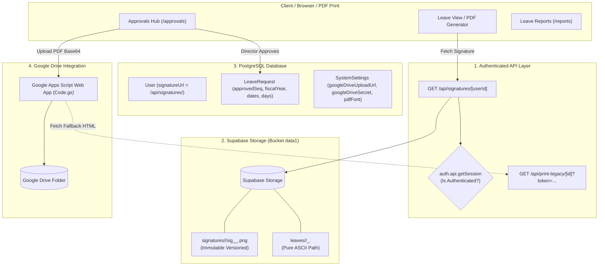

# Session Handoff & System Architectural Rulebook (v2.1)

**Project:** KP e-Leave System (ระบบบริหารจัดการการลาออนไลน์ โรงเรียนกุดจับประชาสรรค์)  
**Last Updated:** 2026-09-17  
**Working Branch:** `dev`  
**Production Branch:** `main`  
**Git Remotes:**
- `origin`: `https://github.com/Kutchapprachasan-School/KP_eLeave_System.git`
- `school`: `https://github.com/khamyangpittayaschool-code/e-leave.git`

---

## 1. Strict User Directives & Prompt Rules (กฎเหล็กประจำระบบ)

1. **Development Branch Rule (กฎการพัฒนาบนกิ่ง dev เท่านั้น):**
   > *"ต่อไปพัฒนาใน bruch เท่านั้น"*
   - งานเขียนโค้ด ทดสอบ แก้ไขไฟล์ทุกชนิด **ต้องทำบนกิ่ง `dev` เท่านั้น**
   - **ห้าม Commit ตรงเข้ากิ่ง `main` โดยเด็ดขาด** (กิ่ง `main` จะใช้เมื่อผู้ใช้สั่งให้ "เอาขึ้น main" หรือ Deploy ขึ้น Production เท่านั้น)
2. **Private & Authenticated Signature Access (กฎความปลอดภัยลายเซ็นต์):**
   - **ห้ามเปิด Public URL ให้กับภาพลายเซ็นต์เด็ดขาด** เพื่อป้องกันการถูกสุ่มเดาหรือดาวน์โหลดไปปลอมแปลง
   - ทุกการเรียกดูภาพลายเซ็นต์ต้องผ่าน Route [`/api/signatures/[userId]`](file:///C:/dev/eLeave/src/app/api/signatures/%5BuserId%5D/route.ts) ซึ่งตรวจสอบ Session (`auth.api.getSession`) เสมอ
   - มีระบบ In-Memory Fast Cache และ ETag เพื่อรองรับการเปิดหรือพิมพ์ PDF แบบกลุ่ม (Batch Print 50-100 ใบ) ได้ในเวลา < 1ms โดยไม่เกิด Serverless Timeout
3. **Immutable Versioned Signatures (กฎห้ามเขียนทับลายเซ็นต์เดิม):**
   - การบันทึกลายเซ็นต์ต้องเป็นแบบ **Immutable** โดยใส่ Timestamp และ Hash ทุกครั้ง (`signatures/<userId>/sig_<timestamp>_<hash>.png`)
   - **ห้ามเขียนทับไฟล์เดิม** เพื่อให้ใบลาและประวัติในอดีตคงลายเซ็นต์ ณ วันที่ลงนามไว้ 100% ตามระเบียบงานสารบรรณ
4. **Pure ASCII Storage Keys for Attachments (กฎความปลอดภัยของ URL ภาษาไทย):**
   - ไฟล์ที่อัปโหลดขึ้น Storage ต้องใช้ชื่อไฟล์และโฟลเดอร์เป็น **ASCII + UUID Hash ล้วนๆ** (`leaves/<reqId>/<timestamp>_<hash>.<ext>`)
   - เพื่อป้องกันปัญหา Percent-Encoding (`%E0%B8...`) ใน PDF Generators, HTTP Headers และ Mobile Browsers
   - ชื่อภาษาไทย (เช่น `เอกสารแนบ_1.jpeg`, `ใบรับรองแพทย์.pdf`) จะถูกเก็บไว้เฉพาะในฟิลด์ `displayName` ในฐานข้อมูลเพื่อแสดงผลบนหน้าเว็บเท่านั้น
5. **Automated CI/CD Dual-Remote Sync (ระบบซิงก์กิ่งอัตโนมัติ):**
   - ยกเลิกการ Push 2 Remotes แบบ Manual โดยเด็ดขาด เพื่อป้องกัน Human Error
   - มี GitHub Actions Workflow [`.github/workflows/mirror-to-school.yml`](file:///C:/dev/eLeave/.github/workflows/mirror-to-school.yml) ทำหน้าที่ Mirror โค้ดจาก `origin/main` ไปยัง `school/main` โดยอัตโนมัติเมื่อมีการ Merge เข้า `main`
6. **No Floating Telemetry Widgets:**
   - ห้ามเพิ่ม Floating Widget หรือแท็บมอนิเตอร์ Egress เข้ามาในหน้าเว็บ เพื่อรักษาความเร็วและความสะอาดตาของ UI

---

## 2. Recent Major Milestones Completed (งานที่เสร็จสมบูรณ์ล่าสุด)

### 1. แก้ไขระบบแปลงใบลาเป็น PDF และบันทึกเข้า Google Drive อัตโนมัติ (Commit `a6cc758`)
- **Backend Resolution:** แก้ไข `approveLeaveRequest` และ `uploadLeavePdf` ใน [`leave.ts`](file:///C:/dev/eLeave/src/app/actions/leave.ts) ให้อ่านค่า `googleDriveUploadUrl`, `googleDriveSecret`, และ `googleDriveFolderId` จากตาราง `SystemSettings` ในฐานข้อมูลเป็นลำดับแรก (Fallback เข้า `.env`)
- **Legacy Print Auth Fix:** แก้ไข [`src/app/api/print-legacy/[id]/route.ts`](file:///C:/dev/eLeave/src/app/api/print-legacy/%5Bid%5D/route.ts) ให้ดึง Secret จาก `SystemSettings` ทำให้ Google Apps Script เข้ามาดึงใบลาเพื่อแปลงเป็น PDF ได้โดยไม่ติด `401 Unauthorized`
- **Settings UI & Test Tool:** เพิ่มส่วนตั้งค่า Google Drive Webhook ใน [`src/app/(app)/settings/page.tsx`](file:///C:/dev/eLeave/src/app/(app)/settings/page.tsx) ครบวงจร ทั้งช่องกรอก Webhook URL, Secret Token (พร้อมปุ่มเปิดปิดตา), Folder ID ปลายทาง, ปุ่มทดสอบการเชื่อมต่อแบบ 1-Click (`testGoogleDriveConnectionAction`), และ Accordion แสดงโค้ดต้นฉบับ Google Apps Script (`Code.gs`) พร้อมปุ่มคัดลอก
- **Approvals Page Hardening:** เพิ่มการแจ้งเตือน Toast ในหน้า [`approvals/page.tsx`](file:///C:/dev/eLeave/src/app/(app)/approvals/page.tsx) ให้ผู้อนุมัติทราบสถานะการส่งเข้า Google Drive ทันที

### 2. ปรับโฉมหน้าออกเลขเกียรติบัตรเป็น MVP (Commit `16913c9`)
- Refactor หน้า [`cert-generator.tsx`](file:///C:/dev/eLeave/src/app/(app)/document/_components/cert-generator.tsx) ให้ใช้งานง่ายเหมือนหน้าขอเลขเอกสาร:
  - **แท็บที่ 1 (ขอเลขเกียรติบัตร):** เลือกบทบาท (ผู้เข้าร่วม, วิทยากร, กรรมการ ฯลฯ), คำนวณยอดรวมอัตโนมัติ, พร้อมแสดง Banner ช่วงเลขที่ได้รับ (เช่น `001-115/2569`) พร้อมปุ่มคัดลอกทันที
  - **แท็บที่ 2 (ประวัติการออกเลข):** ตารางประวัติพร้อมช่องค้นหา กรองข้อมูล และป็อปอัปดูรายละเอียด
  - ตัดสถิติที่ไม่จำเป็นออก และชะลอ Visual Canvas Template Designer ไว้พัฒนาในระยะถัดไป

### 3. ถอดถอน Egress & Data Inspector ทั้งหมด (Commit `400bd7d`)
- ลบ `FloatingEgressWidget` ออกจาก Layout
- ลบ `SupabaseEgressMonitor` และแท็บ `EGRESS_TELEMETRY` ออกจากหน้า Logs เพื่อคืนพื้นที่และความเร็ว

---

## 3. Current Architecture & Cloud Map



---

## 4. Key Code Locations & Engines

| โมดูล / หน้าที่ | ไฟล์โค้ดหลัก | คำอธิบายการทำงาน |
|---|---|---|
| **Leave Reports Page** | [`src/app/(app)/reports/page.tsx`](file:///C:/dev/eLeave/src/app/(app)/reports/page.tsx) | หน้ารายงานสรุปการลา: กรองรอบงบประมาณ (รอบ 1, รอบ 2, ทั้งปี), ภาพรวม, รายบุคคล, ส่งออก Excel (`xlsx`), สั่งพิมพ์รายงาน, และ Batch PDF Download |
| **Cycle Report Server Action** | [`src/app/actions/admin.ts`](file:///C:/dev/eLeave/src/app/actions/admin.ts) (`getCycleReport`) | คิวรีดึงข้อมูลใบลาตามรอบปีงบประมาณและช่วงวันที่ พร้อมจัดกลุ่มสถิติการลา |
| **Leave Actions & Google Drive** | [`src/app/actions/leave.ts`](file:///C:/dev/eLeave/src/app/actions/leave.ts) | ระบบจัดการใบลา, อนุมัติ (`approveLeaveRequest`), อัปโหลดเข้า Drive (`uploadLeavePdf`), และทดสอบการเชื่อมต่อ (`testGoogleDriveConnectionAction`) |
| **Private Signature API** | [`src/app/api/signatures/[userId]/route.ts`](file:///C:/dev/eLeave/src/app/api/signatures/%5BuserId%5D/route.ts) | สตรีมลายเซ็นต์เฉพาะผู้มีสิทธิ์ พร้อม In-Memory Fast Cache (<1ms) ป้องกัน Timeout |
| **System Settings Management** | [`src/app/(app)/settings/page.tsx`](file:///C:/dev/eLeave/src/app/(app)/settings/page.tsx) | ศูนย์กลางตั้งค่าระบบ: ฟอนต์ใบลา, รูปแบบ Drive, Webhook URL, Secret, และการจัดการระบบย่อย |
| **Batch Print Engine** | [`src/app/print/leave/batch/page.tsx`](file:///C:/dev/eLeave/src/app/print/leave/batch/page.tsx) | ระบบออกเอกสารใบลาแบบกลุ่มตามช่วงเลขที่, เดือน, หรือรอบปีงบประมาณ |
| **Certificate MVP Engine** | [`src/app/(app)/document/_components/cert-generator.tsx`](file:///C:/dev/eLeave/src/app/(app)/document/_components/cert-generator.tsx) | ระบบขอเลขเกียรติบัตรแบบ 2 แท็บ สะดวกรวดเร็วตามแบบฉบับ MVP |

---

## 5. Next Task Context: การส่งออกรายงานการลา (Leave Report Export)

โครงสร้างระบบรายงานการลาในปัจจุบันอยู่ที่ [`src/app/(app)/reports/page.tsx`](file:///C:/dev/eLeave/src/app/(app)/reports/page.tsx):
1. **รอบการประเมิน / ปีงบประมาณ:**
   - รองรับรอบที่ 1 (1 ต.ค. – 31 มี.ค.)
   - รองรับรอบที่ 2 (1 เม.ย. – 30 ก.ย.)
   - ทั้งปีงบประมาณ (1 ต.ค. – 30 ก.ย.)
2. **โหมดการแสดงผล (View Modes):**
   - **Overview (ภาพรวม):** รายการใบลาเรียงตามลำดับ มีเลขที่ใบลา, ชื่อ-สกุล, ตำแหน่ง, กลุ่มสาระ, ประเภทการลา, วันที่เริ่ม-สิ้นสุด, จำนวนวัน, เหตุผล, สถานะ
   - **Individual (รายบุคคล):** สรุปยอดวันลาและจำนวนครั้งแยกตามรายบุคคล และแยกตามประเภทการลา (ป่วย, กิจ, พักผ่อน ฯลฯ)
3. **ฟังก์ชันการส่งออกในปัจจุบัน:**
   - **Excel Export:** ใช้ไลบรารี `xlsx` ส่งออกเป็นไฟล์ `.xlsx` (ภาพรวม และ รายบุคคล)
   - **Browser Print:** ป็อปอัปหน้าสรุปพร้อมการ์ดสถิติ (คำขอทั้งหมด, อนุมัติแล้ว, ปฏิเสธ, วันลารวม) สำหรับสั่ง Print เป็นกระดาษหรือ Save as PDF
   - **Batch PDF:** ดาวน์โหลดไฟล์ใบลาจริงแบบเป็นชุดตามช่วงเลขที่หรือตามเดือน

---

## 6. Verification & Quality Gates

- **Unit Tests:** ต้องรันผ่าน 10/10 รายการ:
  ```bash
  npm test
  ```
- **Build Verification:** ตรวจสอบความถูกต้องของการคอมไพล์ Next.js Turbopack:
  ```bash
  npm run build
  ```
- **Git Branch Status:**
  - ทำงานบนกิ่ง `dev` เท่านั้น
  - พร้อมรับคำสั่งปรับแต่ง **การส่งออกรายงานการลา** ในขั้นตอนถัดไปทันที
