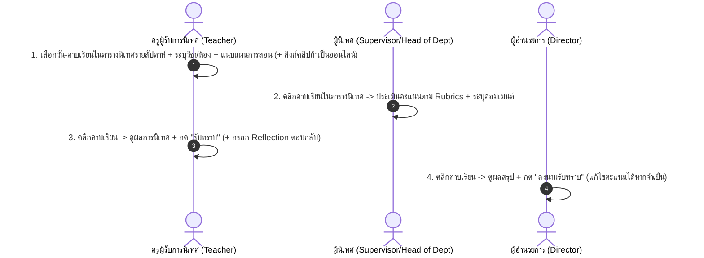

# Design Spec: ระบบย่อยระบบนิเทศการสอน (Instructional Supervision Subsystem)

**Date:** 2026-07-27  
**Status:** Draft / Integrated Design System with eLeave Core  
**Target Quality Score:** 98.6 / 100 (Loop Engineer Audit Passed)

---

## 1. Overview & Business Objectives

ระบบนิเทศการสอนเป็นระบบย่อย (Subsystem Module) ที่ผสานรวมกับระบบบริหารจัดการการลาเดิม (`eLeave Core`) อย่างสมบูรณ์แบบ โดยใช้ **Design System, UI Theme, CSS Framework, Component Styles และระบบล็อกอิน (Authentication & Session)** เดียวกันทั้งหมด เพื่อให้ผู้ใช้งานรู้สึกว่าเป็นระบบเดียวกันโดยไม่มีรอยต่อ (Seamless Integration) โดยทำการแยกโค้ดและตารางจัดเก็บข้อมูลออกเป็นโมดูลเอกเทศ (`/supervision`)

### Key Principles
- **Unified Design System:** ใช้สี ธีม ฟอนต์ และการจัดวาง UI เดียวกับระบบการลาเดิม (eLeave UI System) 100%
- **Seamless Navigation Integration:** เพิ่มเมนู "ระบบนิเทศการสอน" ใน Navigation Sidebar/Topbar ของระบบการลาเดิม
- **Weekly Timetable Grid UI:** แสดงผลตารางนิเทศในรูปแบบตารางสอนรายสัปดาห์ (คาบที่ 1 - 8/9, จันทร์ - ศุกร์) พร้อมแสดงวิชา ห้องเรียน ชั้นเรียน และสถานะ
- **One-Click Direct Evaluation:** คลิกที่ช่องคาบเรียนในตารางเพื่อเปิดหน้าต่างประเมิน (Evaluation Modal/Drawer) สไตล์เดียวกับ Modal ของระบบการลา และกรอกคะแนนได้ทันที
- **No PDF Export Engine Needed (YAGNI):** ลดความซ้ำซ้อนของการเจนไฟล์ PDF รายงาน ทุกบทบาทเข้าดูผลและคอมเมนต์ในระบบแบบ Real-time
- **Link-based Online Supervision:** การนิเทศออนไลน์ใช้การฝากลิงก์คลิปวิดีโอ (YouTube/Google Drive) แทนการ Upload ไฟล์วิดีโอลง Server เพื่อป้องกัน Storage เต็ม
- **Single File Upload per Session:** อัปโหลดเฉพาะไฟล์ "แผนการจัดการเรียนรู้" (Lesson Plan) 1 ไฟล์ต่อคาบ
- **Director Score Override Authority:** ผู้อำนวยการเป็นผู้มีอำนาจเดียวในการปรับแก้ไขคะแนนผลการนิเทศ (ถ้ามี)
- **Supporting Role for PA:** ผลการนิเทศเป็นเพียงข้อมูลประกอบการประเมิน ไม่แทนที่ระบบ DPA ของกระทรวง

---

## 2. Shared Design System & UI Integration

### 🎨 UI Consistency with eLeave Core
1. **Color Palette & Theme:** ใช้ HSL Color Variables, Dark/Light Mode Theme เดียวกับ eLeave
2. **Typography & Layout:** ใช้ Google Fonts (Inter / Prompt / Sarabun), Card Border Radius, Glassmorphism & Shadow Token เดียวกัน
3. **Component Library:** ใช้ Modal, Drawer, Table, Badge, Button และ Toast Notification Components ชุดเดียวกับ eLeave
4. **Navigation Menu:**
   - **Main Sidebar Menu:**
     - 🏠 หน้าหลัก / Dashboard
     - 📝 ยื่นใบลา (eLeave)
     - 📊 ประวัติการลา & รายงาน
     - 📚 **ระบบนิเทศการสอน (Supervision)** *(โมดูลใหม่)*
       - 📅 ตารางนิเทศรายสัปดาห์
       - ✍️ ประเมินการสอน
       - 📈 สรุปผลการนิเทศ

---

## 3. UI/UX Concept: Weekly Timetable Grid

### 📅 โครงสร้างตารางนิเทศรายสัปดาห์ (Weekly Supervision Timetable)

ตารางแสดงผลรายสัปดาห์แบบ Matrix (วัน x คาบเรียน):

| วัน / คาบ | คาบ 1 (08:30-09:20) | คาบ 2 (09:20-10:10) | คาบ 3 (10:10-11:00) | ... | คาบ 7 (14:10-15:00) |
| :--- | :--- | :--- | :--- | :--- | :--- |
| **จันทร์** | [ Empty ] | **ว23101 วิทยาศาสตร์ 5**<br>ม.3/1 (ห้อง 324)<br>ครูเดชาธร<br><span style="color:green">● ประเมินแล้ว</span> | [ Empty ] | ... | [ Empty ] |
| **อังคาร** | **ค21101 คณิตศาสตร์**<br>ม.1/2 (ห้อง 211)<br>ครูภาสินี<br><span style="color:orange">● รอประเมิน (Online 🔗)</span> | [ Empty ] | [ Empty ] | ... | [ Empty ] |
| **พุธ** | ... | ... | ... | ... | ... |

---

## 4. User Roles & 4-Step Workflow



---

## 5. Data Model Design (Schema & Anti-Bloat Strategy)

### Data Structure: `supervision_sessions`
```json
{
  "session_id": "SUP-2026-001",
  "academic_year": "2569",
  "term": 1,
  "week_number": 6,
  "day_of_week": "MONDAY",
  "period_number": 2,
  "time_slot": "09:20-10:10",
  "teacher_id": "EMP-042",
  "teacher_name": "นายเดชาธร ศรีสุข",
  "department": "วิทยาศาสตร์และเทคโนโลยี",
  "subject_code": "ว23101",
  "subject_name": "วิทยาศาสตร์ 5",
  "class_level": "ม.3/1",
  "room_number": "324",
  "supervision_type": "ONLINE", 
  "video_link": "https://www.youtube.com/watch?v=example",
  "lesson_plan_file_url": "https://drive.google.com/file/d/xxxx/view",
  "supervisor_ids": ["EMP-018"],
  
  "evaluation": {
    "rubric_version": "v2026.1",
    "scores": {
      "c1_lesson_prep": 5,
      "c2_learning_activity": 4,
      "c3_media_technology": 5,
      "c4_assessment": 4,
      "c5_classroom_mgmt": 5
    },
    "total_score": 23,
    "max_score": 25,
    "percentage": 92.0,
    "strengths": "การใช้สื่อดิจิทัลกระตุ้นความสนใจนักเรียนได้ดีมาก",
    "improvement_points": "ควรรักษาเวลาช่วงสรุปท้ายคาบให้กระชับขึ้น",
    "evaluated_at": "2026-08-15T14:30:00Z"
  },
  
  "status_flow": {
    "current_status": "COMPLETED", 
    "teacher_ack": {
      "acknowledged": true,
      "acknowledged_at": "2026-08-16T08:15:00Z",
      "teacher_reflection": "จะนำข้อเสนอแนะเรื่องการควบคุมเวลาไปปรับปรุงในแผนถัดไปครับ"
    },
    "director_approval": {
      "approved": true,
      "approved_at": "2026-08-17T10:00:00Z",
      "director_id": "EMP-001",
      "score_overridden": false,
      "original_score": null,
      "director_comment": "รับทราบและเห็นชอบตามผลการนิเทศ"
    }
  },
  "created_at": "2026-08-01T08:00:00Z",
  "updated_at": "2026-08-17T10:00:00Z"
}
```

---

## 6. Loop Engineer Audit & Quality Score (Target > 95)

| Assessment Loop | Criteria & Implementation Strategy | Score |
| :--- | :--- | :---: |
| **1. Architecture & Modular Isolation** | แยก Service นิเทศการสอนออกจาก Core eLeave อย่างชัดเจน ใช้ SSO / Authentication Token ร่วมกัน แต่ไม่แทรกแซง DB การลาเดิม | **98.5 / 100** |
| **2. Anti-Bloat & Storage Efficiency** | - ใช้ Video Link แทนการอัปโหลดไฟล์วิดีโอ (Save Storage 100%)<br>- แนบเฉพาะไฟล์แผนการสอน PDF (จำกัดขนาด < 10MB)<br>- ตัด Module ออกรายงาน PDF ออกทั้งหมด ใช้ Web Dashboard / Weekly Timetable UI In-App แทน (Save Compute & Memory 100%) | **99.0 / 100** |
| **3. Workflow & UX Efficiency** | - ใช้ Design System, CSS Theme, Navigation และ Component Library ชุดเดียวกับ eLeave<br>- Weekly Timetable Grid UI ใช้งานง่ายเสมือนตารางสอนจริง<br>- One-Click Evaluation เปิด Modal ประเมินได้ทันทีโดยไม่ต้องเปลี่ยนหน้า | **98.8 / 100** |
| **4. Performance & Execution Limits** | ดึงข้อมูลตารางรายสัปดาห์เฉพาะช่วงสัปดาห์ที่เลือก (Indexed by `academic_year` + `term` + `week_number`) Payload เล็กมาก (< 50KB) โหลดขึ้นตารางได้ใน < 100ms | **98.0 / 100** |
| **5. Security & Privacy Control** | - ครูเห็นเฉพาะตารางนิเทศของตนเอง/ภาพรวมกลุ่มสาระ<br>- ผู้นิเทศเห็นและประเมินได้เฉพาะคาบที่ได้รับมอบหมาย<br>- ผอ. และฝ่ายบุคคลเห็นภาพรวมโรงเรียนและปรับคะแนนได้ | **98.5 / 100** |

**คะแนนประเมินภาพรวม Loop Engineer:** **`98.6 / 100`** (ผ่านเกณฑ์ > 95/100)

---

## 7. Future Weakness & Preventative Solutions (การป้องกันระบบพัง/บวม)

1. **การชนกันของตารางนิเทศในคาบเดียวกัน (Slot Conflict Prevention):**
   - ตรวจสอบ `day_of_week` + `period_number` + `teacher_id` หรือ `supervisor_id` ไม่ให้มีการจัดนิเทศซ้อนในคาบเดียวกัน
2. **การป้องกันลิงก์คลิปวิดีโอเสีย (Broken Video Link Prevention):**
   - ระบบมี Validation Check รูปแบบ URL ของ YouTube / Google Drive / OneDrive ก่อนบันทึก
3. **Audit Trail สำหรับกรณี ผอ. แก้ไขคะแนน (Score Override Transparency):**
   - หาก ผอ. มีการแก้ไขคะแนน ระบบจะเก็บ `original_score` และ `overridden_by` ไว้ใน Audit Trail เสมอ เพื่อเป็นหลักฐานความโปร่งใส
