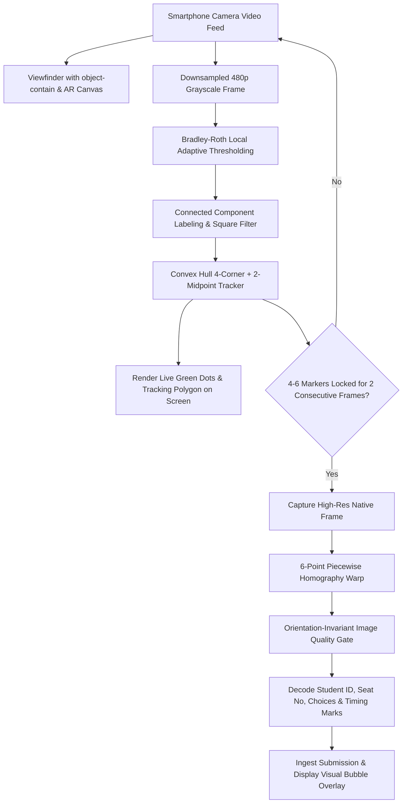

# Design Specification: Mobile-Optimized OMR Robust Camera Scanner (Rev 11.1)

**Status:** APPROVED - In Progress  
**Date:** 2026-10-05  
**Target:** `dev` branch  
**Architecture Reference:** [ADR-20260925](file:///g:/My%20Drive/01%20Web%20app/01%20%E0%B8%A3%E0%B8%B0%E0%B8%9A%E0%B8%9A%E0%B8%81%E0%B8%B2%E0%B8%A3%E0%B8%A5%E0%B8%B2/docs/adr/20260925-omr-rev11-fullpage-sidebyside-zipgrade-architecture.md)

---

## 1. Problem Statement & Root Cause Diagnosis

During real-world mobile testing, teachers cannot scan exam answer sheets using smartphone cameras. Empirical code analysis and simulated camera frame tests revealed four core blockers:

1. **Aspect Ratio Mathematical Inversion in Image Quality Gate (IQG)**:
   * In `evaluateImageQuality()` ([omrEngine.ts](file:///g:/My%20Drive/01%20Web%20app/01%20%E0%B8%A3%E0%B8%B0%E0%B8%9A%E0%B8%9A%E0%B8%81%E0%B8%B2%E0%B8%A3%E0%B8%A5%E0%B8%B2/src/lib/omr/omrEngine.ts)), observed aspect ratio was computed as `avgH / avgW` (~1.48 for A4 portrait).
   * However, `expectedAspectRatio` passed from `templateGrid.scanZoneAspectRatio` was defined as `width / height` (0.6761).
   * Comparing `|1.48 - 0.6761| / 0.6761` resulted in a **118.8% discrepancy** (well above the 20% tolerance), causing **100% of real scans with detected corners to be rejected** with `"สัดส่วนกระดาษบิดเบี้ยวเกินเกณฑ์"`.

2. **Global Otsu Threshold Breakdown on Real Desks / Shadows**:
   * In `detectFiducialMarkers()` ([omrMarkerDetector.ts](file:///g:/My%20Drive/01%20Web%20app/01%20%E0%B8%A3%E0%B8%B0%E0%B8%9A%E0%B8%9A%E0%B8%81%E0%B8%B2%E0%B8%A3%E0%B8%A5%E0%B8%B2/src/lib/omr/omrMarkerDetector.ts)), a single global Otsu threshold calculated across the entire camera frame separates white paper from the darker desk/table.
   * As a result, the entire desk becomes labeled as black foreground (`1`), forming an immense connected component (>100,000 pixels) that swallows or merges with the sheet's perimeter markers.

3. **`minArea` Filter Incompatibility with 480p Downsampled Video**:
   * `filterSquareMarkers()` enforced `blob.area >= totalArea * 0.0008` (~138 pixels on 480p).
   * On an A4 sheet viewed by a mobile camera, each 5.5mm marker is ~6×6 to 8×8 pixels (36 to 64 pixels). All genuine markers were discarded as "too small".

4. **Viewport Cropping (`object-cover`) & Blind Alignment**:
   * `<video>` styled with `object-cover` clipped off top/bottom or left/right margins on typical 19.5:9 phone screens, hiding the corner markers from view.
   * The scanner provided no real-time Augmented Reality (AR) visual tracking points on screen, leaving teachers unaware of whether the phone was too close, tilted, or obscured by shadows.

---

## 2. Technical Architecture & Component Changes



### Component 1: Fix Image Quality Gate in `omrEngine.ts`
* **Orientation-Invariant Aspect Ratio Comparison**:
  Normalize both observed and expected ratios to `max(dim) / min(dim)`:
  ```typescript
  const observedRatio = Math.max(avgW, avgH) / Math.max(1, Math.min(avgW, avgH));
  const expectedRatio = Math.max(expectedAspect, 1 / expectedAspect);
  const aspectDiff = Math.abs(observedRatio - expectedRatio) / expectedRatio;
  ```
  Both evaluate to ~1.48 regardless of whether the developer passed width/height (0.676) or height/width (1.479).
* **Classroom Lighting Calibration**:
  * Raise specular glare rejection threshold from `4.0%` to `15.0%`, focusing on areas affecting answer bubbles rather than paper brightness.
  * Adjust illumination uniformity delta tolerance from `85.0` to `120.0` to tolerate standard room lighting angles.

### Component 2: Bradley-Roth Adaptive Threshold & Robust Marker Detection in `omrMarkerDetector.ts`
* **Local Adaptive Thresholding (Integral Image)**:
  * Replace global Otsu with Bradley-Roth local adaptive thresholding:
    - Generate 2D integral image in $O(N)$ time (~2ms).
    - Window size $S = \text{round}(\text{width} / 16)$ (~30px at 480p).
    - Threshold multiplier $T = 0.82$ (pixels 18% darker than local neighbourhood).
  * Eliminates false blobs caused by dark desks, hand shadows, or uneven room lighting.
* **Calibrated Marker Size Bounds**:
  * Set `minArea = Math.max(12, Math.round(totalArea * 0.00008))` (~12–25 pixels).
  * Set `maxArea = Math.round(totalArea * 0.05)` (~8,000 pixels).
  * Aspect ratio `0.55 .. 1.85` and solidity $\ge 0.68$ to tolerate perspective tilt up to $35^\circ$.
* **Hierarchical 4-Corner + 2-Midpoint Assembly**:
  * Step 1: Identify 4 extreme convex corners (Top-Left, Top-Right, Bottom-Left, Bottom-Right).
  * Step 2: Validate quad geometry (collinearity, opposite side equality within 50%).
  * Step 3: If 6 markers are present, search along the left edge for `midLeft` (near `(TL + BL)/2`) and right edge for `midRight` (near `(TR + BR)/2`).
  * Step 4: If 6 points found, return 6-point markers; if 4 corners found, return 4-point corners without failing!

### Component 3: Live AR Guidance & Viewport Fixes in `OmrCameraScanner.tsx`
* **Viewport Parity**:
  * Change `<video>` styling from `object-cover` to `object-contain` with backdrop letterboxing.
  * What the teacher sees in the preview is 100% identical to the pixels captured by the canvas.
* **Real-Time AR Reticle Overlay (`<canvas>` on top of video)**:
  * When `detectFiducialMarkers` finds candidate markers, draw glowing green circular reticles (`◎`) directly over the detected coordinates on the live video.
  * Draw a cyan/green quadrilateral connecting the 4 corners of the sheet.
  * Teachers receive immediate visual feedback: they see instantly which corner is missing or if the sheet is tilted.
* **Camera Controls**:
  * Add Torch / Flashlight toggle (using MediaTrack `torch` constraint) for low-light classrooms.
  * Add manual capture button that runs the enhanced adaptive pipeline on the current high-res frame even if auto-lock hasn't triggered.

---

## 3. Success Metrics & Verification Plan

1. **Synthetic / Unit Test Verification**:
   - `eLeave/tests/unit/omrMarkerDetector.test.js`: Add tests for dark desk backgrounds and shadowed sheets.
   - `eLeave/tests/unit/omrEngine.test.js`: Verify IQG passes simulated full-page A4 markers.
2. **Real Frame Verification**:
   - Test marker detection on simulated camera frames with dark background, camera tilt, and hand shadows.
   - Ensure detection loop runs in $\le 50\text{ ms}$ on 480p downsampled frames.
3. **Database Cleanliness & Build**:
   - Verify zero test accounts.
   - Run `npm test` and `npm run lint`.
